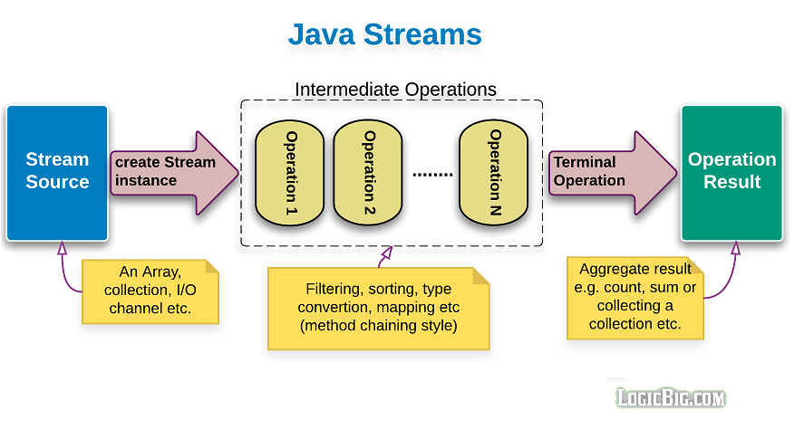
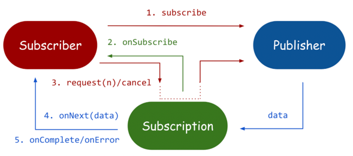
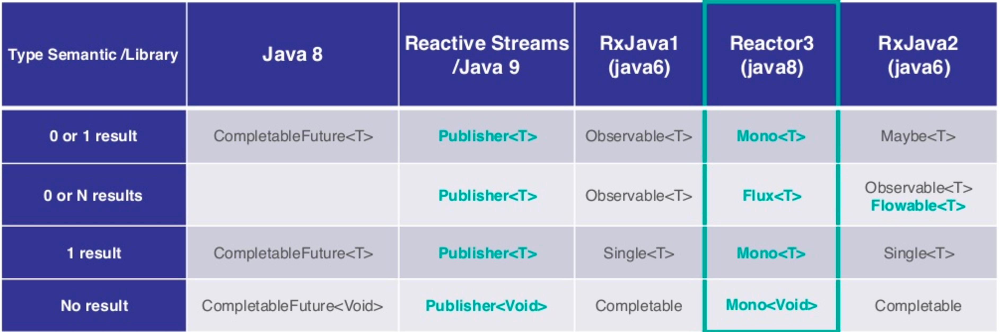
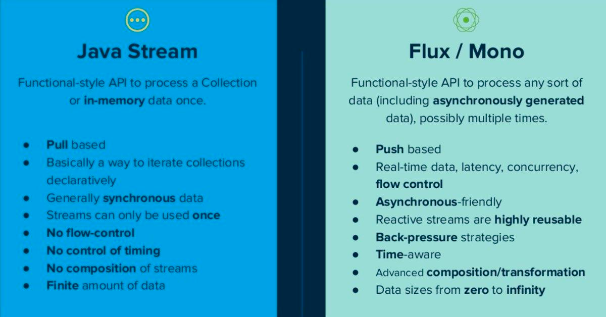

# Reactive Programming

## Java Stream

https://docs.oracle.com/javase/8/docs/api/java/util/stream/Stream.html

```
public interface Stream<T>
extends BaseStream<T,Stream<T>>
```

A sequence of elements supporting sequential and parallel aggregate operations. The following example illustrates an aggregate operation using Stream and IntStream:



```java
    private final int THREE = 3;
    private final int FIVE = 5;
    BiPredicate<Integer, Integer> isMultiple = (l, i) -> l % i == 0;
    Predicate<Integer> isMultiple3 = number -> isMultiple.test(number, THREE);
    Predicate<Integer> isMultiple5 = number -> isMultiple.test(number, FIVE);

    public Integer JavaStreamSolution(Integer limit) {

        return IntStream.range(1, limit).boxed()
                .filter(isMultiple3.or(isMultiple5))
                .reduce(0, Integer::sum);
    }
```

A stream pipeline consists of a stream source, 
followed by zero or more intermediate operations, 
and a terminal operation.


## Reactive Stream

Reactive Streams is an initiative to provide a standard for asynchronous stream processing with non-blocking back pressure. This encompasses efforts aimed at runtime environments (JVM and JavaScript) as well as network protocols.



```java
    private final int THREE = 3;
    private final int FIVE = 5;
    BiPredicate<Integer, Integer> isMultiple = (l, i) -> l % i == 0;
    Predicate<Integer> isMultiple3 = number -> isMultiple.test(number, THREE);
    Predicate<Integer> isMultiple5 = number -> isMultiple.test(number, FIVE);

    public Mono<Integer> ReactorSolution(Integer limit) {

        return Flux.range(0, limit)
        .filter(isMultiple3.or(isMultiple5))
        .reduce(0, Integer::sum);
    }
```



- Mono: https://projectreactor.io/docs/core/release/api/reactor/core/publisher/Mono.html
- Flux: https://projectreactor.io/docs/core/release/api/reactor/core/publisher/Flux.html

```
Stream and Flux are quite different:

Stream is single use, vs. you can subscribe multiple times to Flux
Stream is pull based (consuming one element calls for the next one) vs. Flux has an hybrid push/pull model where the publisher can push elements but still has to respect backpressure signaled by the consumer
Stream are synchronous sequences vs. Flux can represent asynchronous sequences
In example you're generating an infinite sequence of values with Stream, they're produced and consumed as fast as possible. In your Flux example, you're producing values at a fixed interval (something I'm not sure you can do with Stream). With Flux, you can also Flux.generate sequences without intervals, just like your Stream example.

In general, you could consider Flux as a mix of Stream + CompletableFuture, with:

a lot of powerful operators
backpressure support
control over publisher and subscriber behavior
control over the notion of time (buffering windows of values, adding timeouts and fallbacks, etc)
something tailored for async sequences fetched over the network (from a database or a remote Web API)
```



## References

- https://www.reactive-streams.org/
- https://stackoverflow.com/questions/52820232/difference-between-infinite-java-stream-and-reactor-flux
- https://blog.frankel.ch/backpressure-reactive-systems/


